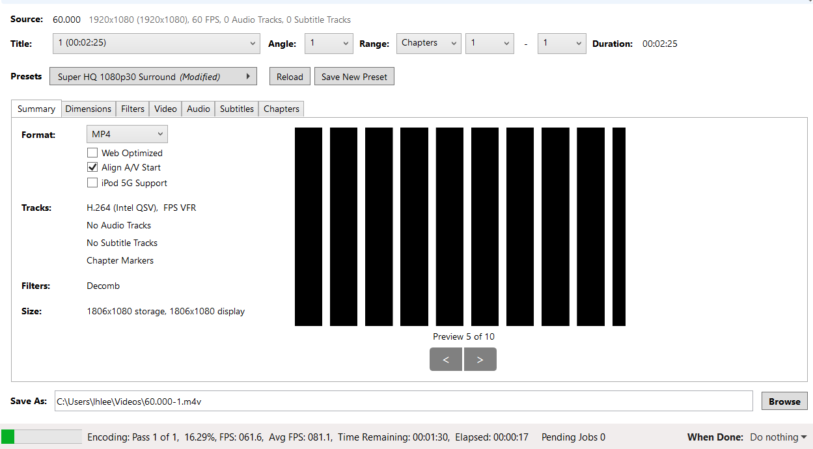
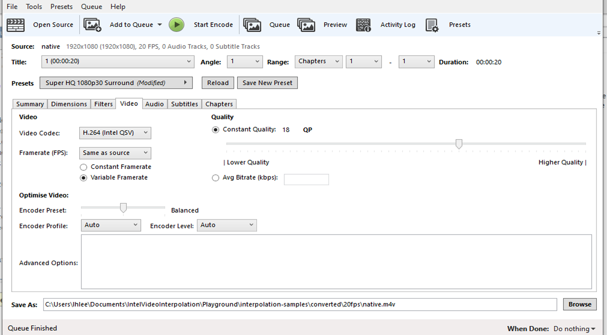

# Playground Notes

Running matlab in CLI: `matlab -batch "Main; exit"`

To read mkv files install Install MPEG-2 Video Extension in Windows Store. 
Can use `https://www.mediaplayercodecpack.com/` as well

## Handbrake settings

Matlab does not support `.mkv` out of the box. Hence, I converted to H.264 `.m4v` which is supported.

The 60.000.mkv converted video has quality set to 0, file size is ok.

Intel QSV (QuickSync Video) uses Intel HD Graphics to encode, faster speed.

## Hack to insert Latex in Markdown

## 25 fps PAL video
Usually speed change to 24 first, then conv to 60, but this cannot happen in real-time.

Ask if this is in spec.

## Time taken for Main

Informal results, background processes are running.

Intel Core i7-7600U - `lhl2617`

Quality: Default (75)

Code: Commit with title "TIMED"

### 24 -> 60

| Mode          | Time Taken (s) |
| ------------- | -------------- |
| Nearest       | 128.920984     |
| Oversample    | 179.782802     |
| Linear        | 238.907429     |

### 30 -> 60

Note: oversample here has same output as nearest as 60 is a multiple of 30

| Mode          | Time Taken (s) |
| ------------- | -------------- |
| Nearest       | 134.871161     |
| Oversample    | 143.272113     |
| Linear        | 273.243417     |

### 20 -> 60

Note: oversample here has same output as nearest as 60 is a multiple of 20

| Mode          | Time Taken (s) |
| ------------- | -------------- |
| Nearest       | 154.151127     |
| Oversample    | 145.423843     |
| Linear        | 264.317527     |

### SSH into DoC
- Tried but the doc linux matlab does not have support for m4v.

### SSH FileSystem into DoC
http://makerlab.cs.hku.hk/index.php/en/mapping-network-drive-over-ssh-in-windows

## Time taken for Python

Informal results

corona50.doc.ic.ac.uk - Intel Core i7-8700

Quality: 6

Code: Commit with title "Python_TIMED"

### 24 -> 60

| Mode          | Time Taken (s) | Preloaded (s) |
| ------------- | -------------- | ------------- |
| Nearest       | 16.372         | 15.268        |
| Oversample    | 23.628         | 21.718        |
| Linear        | 56.420         | 52.564        |

### 30 -> 60

Note: oversample here has same output as nearest as 60 is a multiple of 30

| Mode          | Time Taken (s) | Preloaded (s) |
| ------------- | -------------- | ------------- |
| Nearest       | 16.735         | 15.576        |
| Oversample    | 16.750         | 15.509        |
| Linear        | 56.288         | 52.813        |

### 20 -> 60

Note: oversample here has same output as nearest as 60 is a multiple of 20

| Mode          | Time Taken (s) | Preloaded (s) |
| ------------- | -------------- | ------------- |
| Nearest       | 16.075         | 14.835        |
| Oversample    | 16.112         | 14.760        |
| Linear        | 56.612         | 52.628        |

## Testbench notes

nearest
mean psnr: 24.753013328096596
mean ssim: 0.7527262803972358
oversample
mean psnr: 24.753013328096596
mean ssim: 0.7527262803972358
linear
mean psnr: 28.020856993945454
mean ssim: 0.8044421052133458